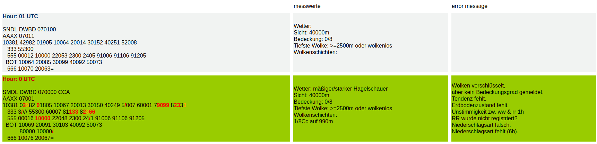

# Synopstalking

PHP script to print and check the weather reports of 10381 on a browser

## How does it works

### How the error message work

To mark erros two colours are in use.
* Red for cases in which the programmer is sure that there is something wrong (safe error).
* Orange for cases in which it isn’t a "safe error" or to mark dependency to a safe error.

## Datasource
http://www.met.fu-berlin.de/de/wetter/service/obs_10381/

## Output Version
### Sysnops of the last two days
http://sted15.userpage.fu-berlin.de/turm/fm12/synops.php
### Sysnops of the last two days with error messages
http://sted15.userpage.fu-berlin.de/turm/fm12/synopsturm.php
### Sysnops of the last ten days
http://sted15.userpage.fu-berlin.de/turm/fm12/quali.php

### How you can run this project by you own
1. Downloading files from the data source with one of the two bash scripts in the getReports directory. The scripts are changing the names, as well.
2. Upload the files too your server how frequently you want. 
2. Ensure that the php, html, and css in the same directory on your server as the files with the reports of 10381.
